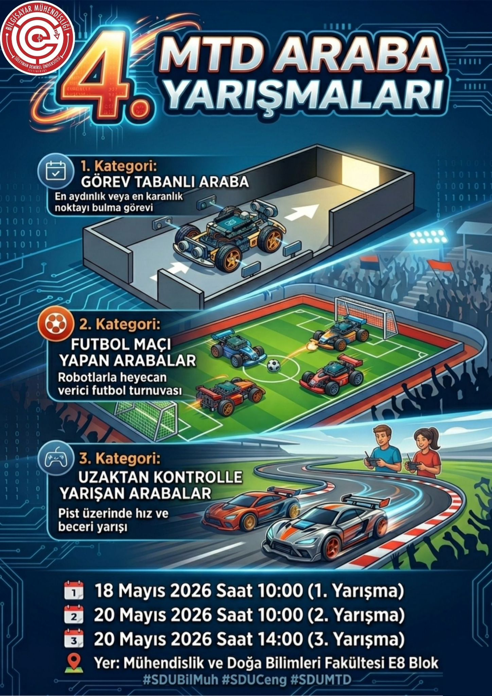
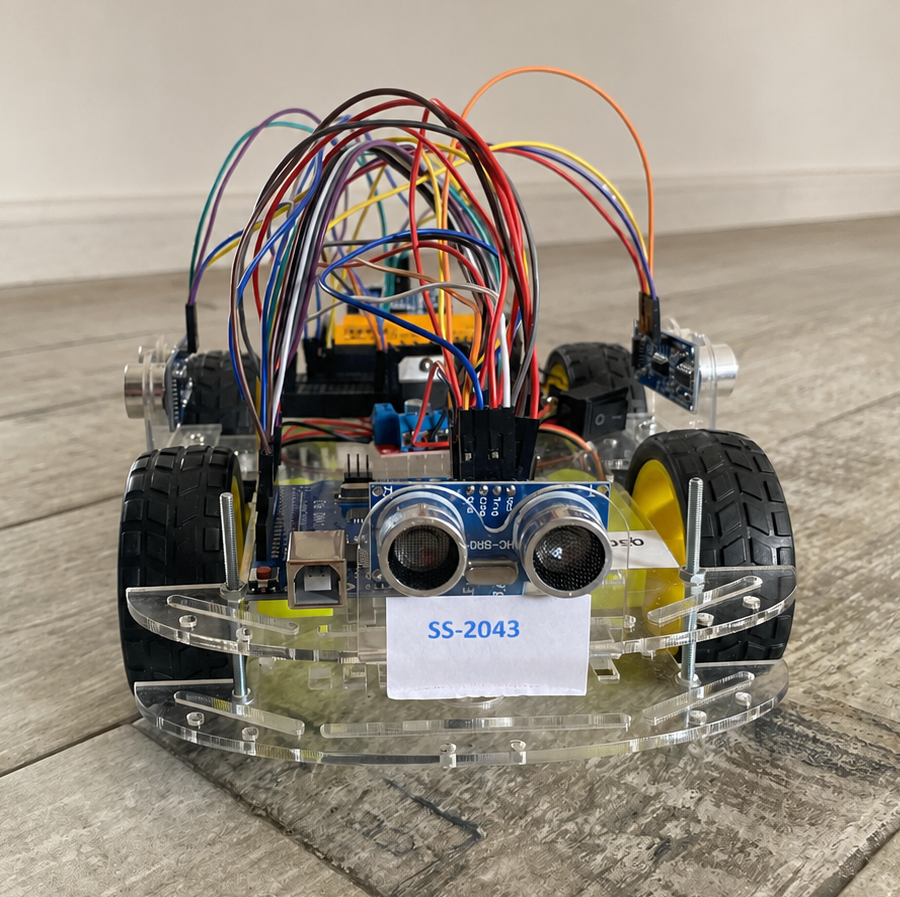

  

# 🏆 MTD Araba Yarışmaları 

Bu depo, **Süleyman Demirel Üniversitesi** tarafından düzenlenen **4. MTD Araba Yarışmaları** kapsamında geliştirilen aracın **yarışmada kullanılan nihai (final) sürüm kodlarını** içermektedir.

🚗 **Bu proje ile 4. MTD Araba Yarışmaları'nın 2. Kategorisi (Futbol Maçı Yapan Arabalar)** yarışmasında **2.'lik derecesi** elde edilmiştir.

---

## 🚗 Yarışmada Kullanılan Araç

  

---

## 📂 Depo İçeriği

Bu depoda, yarışma öncesinde gerçekleştirilen geliştirmeler ve testler sonucunda elde edilen, yarışma sırasında kullanılan **son ve kararlı sürüm kodları** bulunmaktadır.

## ⚙️ Projede Kullanılan Donanımlar

* ArduinoUNO
* Ultrasonik Mesafe Sensörleri
* LDR (Işık Sensörleri)
* DC Motorlar
* Motor Sürücü Kartı
* Bluetooth Modülü (HC-05)

## 🎯 Amaç

Bu depo, yarışmada kullanılan nihai yazılımı arşivlemek, proje geliştirme sürecini belgelemek ve benzer robotik projeler geliştiren geliştiricilere örnek olması amacıyla paylaşılmıştır.

---

## 🏅 Yarışma Sonucu

**🥈 4. MTD Araba Yarışmaları**
**2. Kategori – Futbol Maçı Yapan Arabalar**
**2.'lik Derecesi**
